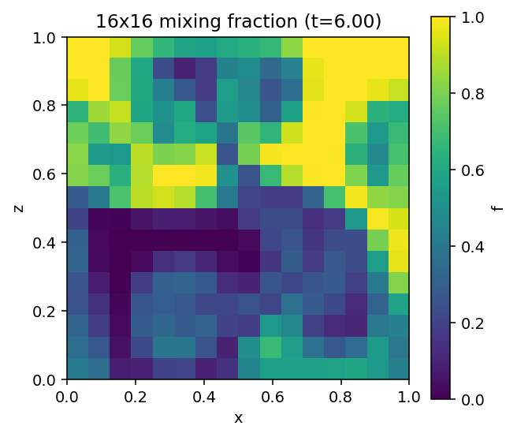
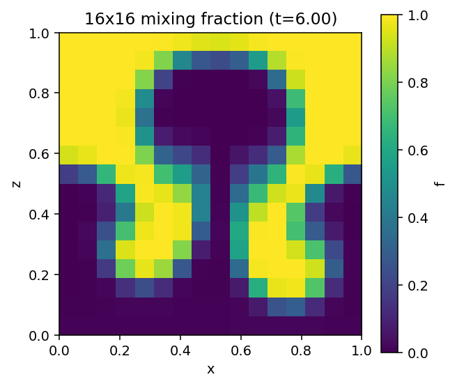
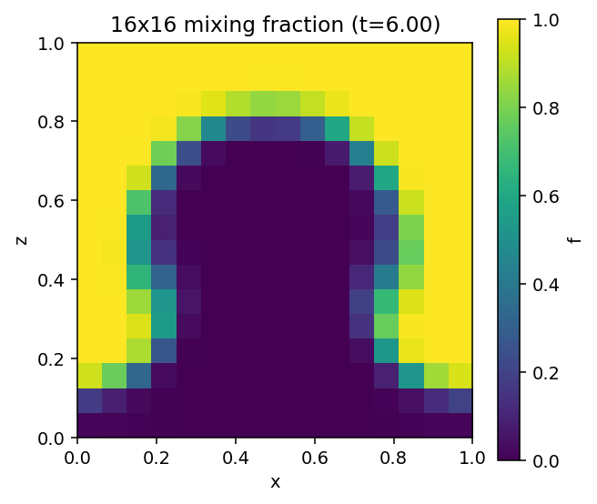

# Rayleigh-Taylor Instability in Stellar Interiors

> **MHD stability analysis and 2-D finite-volume simulations of magnetised Rayleigh-Taylor instability**

This project investigates the **Rayleigh-Taylor instability (RTI) in a magnetised stellar environment**. The work combines an analytical MHD dispersion relation with self-written **two-dimensional finite-volume simulations** to study how magnetic fields modify the growth of the instability and its characteristic length scales.

The project has three main goals:

1. Derive a general MHD dispersion relation for the Rayleigh-Taylor instability.
2. Determine the **critical** and **fastest-growing wavelengths** as functions of the physical parameters.
3. Test the analytical predictions using direct numerical simulations of magnetised fluids.

---

## Overview

The Rayleigh-Taylor instability occurs when a dense fluid is supported against gravity by a lighter fluid. Small perturbations at the interface grow with time, producing the familiar **bubble-and-spike morphology**.

In a stellar interior, however, the fluid can be magnetised. Magnetic tension introduces an additional restoring force that preferentially suppresses short-wavelength perturbations. This changes both the unstable wavelength range and the rate at which different modes grow.

This project therefore connects three levels of analysis:

**Linear theory → characteristic wavelengths → nonlinear numerical evolution**

---

## 1. Physical problem

For two fluids of densities $\rho_1$ and $\rho_2$ separated by an interface in a gravitational field $g$, the classical Rayleigh-Taylor instability is characterised by the Atwood number

$
A = \frac{\rho_2-\rho_1}{\rho_2+\rho_1}.
$

For a perturbation with wavenumber $k$, gravity drives the instability while magnetic tension resists bending of field lines.

For the canonical incompressible, tangential-field limit, the linear MHD dispersion relation can be written as

$
\omega^2
= -A g k
+ \frac{B_1^2+B_2^2}{\mu_0(\rho_1+\rho_2)}k^2\cos^2\theta,
$

where $\theta$ is the angle between the perturbation wavevector and the magnetic field.

Writing $\omega^2<0$ as $\omega=i\gamma$, the growth rate is

$
\gamma^2
= A g k
- \frac{B_1^2+B_2^2}{\mu_0(\rho_1+\rho_2)}k^2\cos^2\theta.
$

This immediately shows the competition between **buoyant/gravitational driving** and **magnetic tension**.

### Consequences of magnetic tension

- Long wavelengths can remain unstable because gravity dominates.
- Sufficiently short wavelengths are stabilised by magnetic tension.
- The instability becomes anisotropic when the magnetic field selects a preferred direction.
- Increasing the field strength shifts the instability towards larger spatial scales.

---

## 2. Critical and fastest-growing wavelengths

The marginally stable mode is obtained from $\gamma=0$. This defines a critical wavenumber $k_c$, above which perturbations are suppressed.

For the form above,

$
k_c
= \frac{A g\,\mu_0(\rho_1+\rho_2)}{(B_1^2+B_2^2)\cos^2\theta}.
$

The corresponding critical wavelength is

$
\lambda_c = \frac{2\pi}{k_c}.
$

Maximising $\gamma(k)$ gives the fastest-growing mode at

$
k_{\rm max}=\frac{k_c}{2},
$

and therefore

$
\lambda_{\rm max}=2\lambda_c.
$

These analytical scales provide a direct benchmark for the numerical simulations.

> **Key physical idea:** magnetic tension acts as a scale-dependent stabilising mechanism. The code can therefore be tested not only by whether RTI develops, but also by whether the observed growth behaves consistently with the predicted preferred wavelength.

---

## 3. Numerical method

The analytical calculation is complemented by a self-written **2-D finite-volume MHD solver**.

The numerical workflow is:

```text
Initial condition
       ↓
Perturb density / interface
       ↓
Solve ideal MHD equations
       ↓
Recover fluxes at cell interfaces
       ↓
Advance conserved variables
       ↓
Apply boundary conditions
       ↓
Track density, velocity and magnetic field
       ↓
Compare growth with linear theory
```

The finite-volume formulation is particularly useful because the conserved quantities are evolved through fluxes across cell boundaries, making the method well suited to shocks and strongly nonlinear structures.

The simulations are performed in **two spatial dimensions** and are designed to resolve the transition from a perturbed interface to the characteristic nonlinear RTI morphology.

---

## 4. Simulation results

### Mixing fraction

The updated $256\times256$ MHD runs are summarised below using the final mixing-fraction maps.

<p align="center">
  
</p>

<p align="center">
  
</p>

<p align="center">
  
</p>

These maps show the nonlinear mixing produced by representative magnetic configurations.

### Full MHD figure sets

The complete simulation outputs are available in the [Figures directory](Rayleigh-Taylor_Instability_in_stellar_interior/Figures/). Representative files include:

- [B0_uniform_256x256.pdf](Rayleigh-Taylor_Instability_in_stellar_interior/Figures/B0_uniform_256x256.pdf)
- [B0.1_0_(1,)_uniform_256x256.pdf](Rayleigh-Taylor_Instability_in_stellar_interior/Figures/B0.1_0_(1,)_uniform_256x256.pdf)
- [B0.1_0_(2,)_uniform_256x256.pdf](Rayleigh-Taylor_Instability_in_stellar_interior/Figures/B0.1_0_(2,)_uniform_256x256.pdf)
- [B0.1_0_(8,)_uniform_256x256.pdf](Rayleigh-Taylor_Instability_in_stellar_interior/Figures/B0.1_0_(8,)_uniform_256x256.pdf)
- [B0.5_0_(1,)_uniform_256x256.pdf](Rayleigh-Taylor_Instability_in_stellar_interior/Figures/B0.5_0_(1,)_uniform_256x256.pdf)
- [B0.2_uniform_Bz0.15_256x256.pdf](Rayleigh-Taylor_Instability_in_stellar_interior/Figures/B0.2_uniform_Bz0.15_256x256.pdf)
- [Bz_0.2_uniform_256x256.pdf](Rayleigh-Taylor_Instability_in_stellar_interior/Figures/Bz_0.2_uniform_256x256.pdf)

The analytical figures include [growth_rate_for_different_B.pdf](Rayleigh-Taylor_Instability_in_stellar_interior/growth_rate_for_different_B.pdf), [growth_rate_for_two_B.pdf](Rayleigh-Taylor_Instability_in_stellar_interior/growth_rate_for_two_B.pdf), [growth_rate_vs_k_for_B.pdf](Rayleigh-Taylor_Instability_in_stellar_interior/growth_rate_vs_k_for_B.pdf), [gamma_vs_k_z.pdf](Rayleigh-Taylor_Instability_in_stellar_interior/gamma_vs_k_z.pdf), and [stability_regions.pdf](Rayleigh-Taylor_Instability_in_stellar_interior/stability_regions.pdf).

---

## 5. Theory versus simulation

A central objective of the project is to verify that the numerical evolution reflects the predictions of linear theory in the regime where the perturbations remain small.

The comparison focuses on:

| Quantity | Analytical prediction | Numerical measurement |
|---|---|---|
| Stability threshold | $k_c$ or $\lambda_c$ | Onset of suppression of unstable modes |
| Preferred scale | $k_{\rm max}$, $\lambda_{\rm max}$ | Dominant mode in the simulated evolution |
| Growth | $\gamma(k)$ | Measured amplitude growth |
| Magnetic effect | Stronger tension at small scales | Reduced short-wavelength growth |

Agreement between these quantities provides a stringent test of the implementation rather than relying only on visual agreement of density maps.

---

## 6. Parameter studies

The code can be used to investigate how the instability changes with the physical parameters controlling the competition between gravity and magnetic tension.

Typical studies include:

- magnetic-field strength,
- density contrast / Atwood number,
- perturbation wavelength,
- perturbation orientation relative to the field,
- numerical resolution,
- evolution time.

These studies can be used to construct stability maps and identify the parameter regime in which magnetic fields substantially modify the instability.

---

## 7. Representative 3-D visualisations

The repository also contains 3-D visualisations of the simulated fields, which help highlight the spatial structure of the evolving instability.


---

## 8. Repository structure

```text
Rayleigh-Taylor_instability_in_Stellar_Interior/
│
├── Rayleigh-Taylor_Instability_in_stellar_interior/
│   ├── Figures/
│   ├── *.py
│   ├── *.ipynb
│   └── ...
│
└── README.md
```

The main simulation and analysis scripts are located inside the project directory, while generated plots and visualisations are organised under `Figures/`.

---

## 9. Running the simulations

Clone the repository:

```bash
git clone https://github.com/yugeshbhoge/Rayleigh-Taylor_instability_in_Stellar_Interior.git
cd Rayleigh-Taylor_instability_in_Stellar_Interior/Rayleigh-Taylor_Instability_in_stellar_interior
```

Create a Python environment and install the required scientific packages used by the scripts. A typical setup is:

```bash
python3 -m venv rti-env
source rti-env/bin/activate
pip install numpy scipy matplotlib h5py
```

Run the corresponding simulation script from the project directory. For example:

```bash
python3 rti_mhd_2d.py
```

> The exact command-line parameters depend on the version of the simulation script in the repository. Check the script's argument parser / help message for the currently available options.

---

## 10. Why this project matters

The project is a compact example of how **analytical plasma physics and computational fluid dynamics can be combined to study astrophysical instabilities**.

The main methodological point is that numerical simulations are not used merely to produce visualisations. The simulation is constructed as a quantitative test of the underlying theory:

$
\boxed{\text{Analytical dispersion relation}
\;\longrightarrow\;
\text{characteristic scales}
\;\longrightarrow\;
\text{numerical verification}}
$

This framework is directly relevant to the study of magnetised stellar interiors, buoyancy-driven flows, mixing, and other MHD instabilities in astrophysical plasmas.

---


---

## 12. Author

**Yugesh Bhoge**
M.Sc. Physics, Indian Institute of Technology Bombay

Research interests: **Computational Astrophysics · Magnetohydrodynamics · Gravitational-Wave Astrophysics · Multimessenger Astronomy**

[GitHub](https://github.com/yugeshbhoge)

---

## Citation / reuse

If you use this code, figures, or derivations in your work, please cite the repository and any associated report or publication when available.

---

### Notes on the figures in this README

